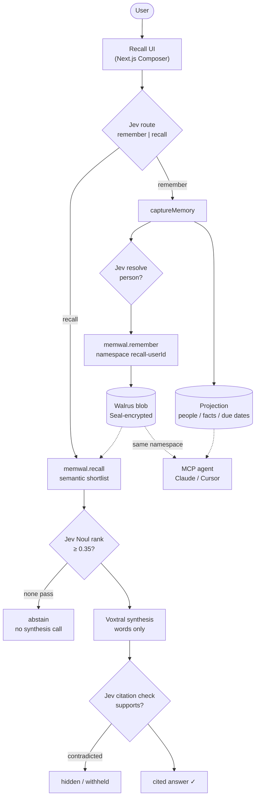

# 🪳 Recall — Remember Every Person

**Recall is a relationship-memory chatbot built on Walrus.** You tell it, in
plain words, about the people you meet ("Met Sarah at the AI meetup, she's
hiring React devs, I promised to intro her to Priya") — and every memory
becomes an **encrypted blob on Walrus**, recalled semantically across
sessions through **Walrus Memory**. Ask questions in natural language, get
answers grounded in the *exact* memories they came from, and get a daily
**"Today" feed** so relationships never quietly go cold.

Built for **Walrus Session 8: Chatbots That Remember**. Recall's thesis: an AI
that helps you remember people is only useful if its memory is **durable,
portable, and trustworthy** — memory that survives sessions, moves across
apps, and never gets invented. Walrus is that layer; everything else in this
repo exists to serve it.

> ### 🚀 Live demo
> **https://recall-walrus-memory.fly.dev** — deployed on Fly.io
> (single 256MB machine + persistent volume), backed by Walrus Memory on
> mainnet. Sign in with any email (or `demo@recall.app` for seeded
> Hosting, backed by Walrus Memory on mainnet. Sign in with any email (or
> `demo@recall.app` for seeded data). Health + blob proof:
> `GET /api/health` → `counts.walrus_blobs`.

---

## Why this is a real product (not a dashboard)

- **User problem:** People with large networks (founders, salespeople,
  recruiters, investors, community builders) forget names, context, and
  promises. Existing CRMs are heavy data-entry tools; note apps don't
  *recall*. The pain is frequent, emotionally charged (embarrassment, lost
  deals), and poorly served.
- **The wedge:** capture is *conversational* (one sentence), recall is *cited*
  (never invented), and follow-up is *proactive* (a daily nudge). No forms, no
  pipeline stages, no admin panel.
- **The moat is the memory:** value compounds the more you tell it — and
  because that memory lives on Walrus, it is **portable across sessions, apps,
  and providers**, encrypted by default, and independently verifiable. Your
  network is yours, not your app's.

---

## How Walrus powers Recall (the core of the entry)

Walrus is not a feature here — it is the memory. The local process keeps only
a thin structured projection (people, facts, due dates); every word the user
said lives in Walrus:

- **Capture** (`lib/memory.ts: captureMemory`): Bedrock extracts person +
  facts + commitments → Jev resolves *which* person (Choice over roster +
  spans, never invented) → the enriched text is persisted via Walrus Memory
  into the user's namespace (`recall-<userId>`) → the returned **blob id**
  lands on the local memory row. One capture = one certified mainnet blob.
- **Recall** (`lib/memory.ts: recall`): `memwal.recall()` searches the user's
  namespace by meaning — *"who's hiring frontend people?"* finds *"hiring
  senior React engineers"* — then Jev ranks the shortlist with calibrated
  0–1 scores, sub-threshold pools **abstain without a synthesis call**, and
  every shown citation carries a machine-checked verdict (✓ verified,
  contradicted hidden).
- **Multi-tenant isolation** (`lib/memwal.ts`): one operator MemWalAccount
  pays for storage (no per-user funding); each app user gets a deterministic
  namespace. Recall is scoped per account + namespace; the delegate key never
  leaves the server.
- **Portable by construction:** the same namespace is readable from the web
  app *and* from any agent via Recall's per-user MCP server (`/api/mcp`) —
  web-captured memories answer Claude Code questions with zero re-entry.
- **Resilient by design:** if Walrus is unreachable (or unconfigured in local
  dev), capture still saves locally and recall falls back to keyword search +
  generative rerank — the product never loses what you told it. `restore()`
  rebuilds the relayer index from Walrus blobs at any time.

Every recall answer returns **citations** to the source memories, so the
answer is auditable and never fabricated.

### Recall's own MCP server, per user

Every signed-in user can generate an API key in the app and connect their
agent to *their own* Walrus-backed memory at `/api/mcp` (read-only,
auto-scoped by user): `list_people`, `search_memories`, `ask_memory`,
`get_person`, `get_today`, `recent_memories`. See
**[docs/ops-agent.md](docs/ops-agent.md)** for the exact steps, per-tool
configs, and example prompts.

### Calibrated judgments: Jev decides, Voxtral writes

A generative LLM writes good words and makes unaccountable choices. Recall
splits the two — every *decision* is a typed TypeSafe (Jev) judgment with
probabilities + confidence, and the generative model only renders prose from
decided context (`lib/judge.ts`, see **[docs/judgments.md](docs/judgments.md)**).
Jev is TypeSafe's own model and Voxtral is Mistral — neither is Anthropic or
OpenAI, so the *Beyond the Big Two* track holds. Every judgment degrades
gracefully to generative fallbacks when unconfigured.

### Prose renderer: Bedrock Mantle (Mistral Voxtral Mini 3B)

One bearer API key, no IAM, no vector code: extraction JSON + answer synthesis
only. With no key (`AI_PROVIDER=mock`) or no Walrus/TypeSafe keys, deterministic
local paths keep the full product demoable end-to-end.

---

## Architecture



```
app/                     Next.js 15 App Router (React 19, server components)
  page.tsx               Landing + passwordless sign-in
  workspace/page.tsx   Main workspace: Composer + Today feed + People
  workspace/person/[id]/ Person profile: facts + memory timeline + blob links
  actions.ts             Server actions (only write path; auth-scoped)
components/
  Composer.tsx           One box, auto-routed: Remember / Recall (cited ✓)
  TodayCard.tsx          Follow-up card: Done / Snooze / copy draft
lib/
  memwal.ts              Walrus Memory client + per-user namespaces
  judge.ts               TypeSafe judgments: route, resolve, rank, verify
  store.ts               Local projection (people/facts/commitments/users)
  memory.ts              Domain logic: captureMemory() + recall()
  ai.ts                  Bedrock Mantle prose (Voxtral Mini) + mock fallback
  auth.ts                Signed httpOnly session; strict per-user isolation
  env.ts                 Zod-validated, fail-fast config (no DB, no IAM)
scripts/
  verify-memwal.ts       Prove the Walrus round-trip (pnpm memwal:verify)
  verify-judge.ts        Prove the judgments live (pnpm judge:verify)
  seed.ts                Seed demo memories (pnpm seed — real Walrus blobs)
  run-nudges.ts          Daily reconnect nudges (pnpm nudge:run)
docs/
  ops-agent.md           MCP server workflow + demo script
  judgments.md           Judgment thresholds, fallbacks, cost/latency
  submission-checklist.md Walrus Session 8 eligibility + prize tracks
  video-script.md        Before/after demo recording script
  walrus-feedback.md     Session feedback draft + bug-bounty tracker
```
---

## Getting started

### 1. Prerequisites
- Node ≥ 20 (tested on 22), `pnpm`
- A Walrus Memory account: generate one at
  [memory.walrus.xyz](https://memory.walrus.xyz) (mainnet — required for the
  Session's ≥10-blob proof) or
  [staging.memory.walrus.xyz](https://staging.memory.walrus.xyz) (testnet).
  No database to install — the structured projection is a local JSON file.

### 2. Configure
```bash
cp .env.example .env.local
# set AUTH_SECRET (openssl rand -base64 48)
# set MEMWAL_PRIVATE_KEY + MEMWAL_ACCOUNT_ID (from the dashboard above)
# optional: BEDROCK_API_KEY + TYPESAFE_API_KEY — or AI_PROVIDER=mock for zero-cred demo
```

### 3. Install, init, prove, seed
```bash
pnpm install
pnpm store:init       # ensure the local projection file exists
pnpm memwal:verify    # prove the Walrus round-trip (health → blob → recall)
pnpm judge:verify     # prove the judgments live (route → resolve → rank → verify)
pnpm seed             # optional: demo user with realistic memories (real blobs)
```

### 4. Run
```bash
pnpm dev             # http://localhost:3000
```
Sign in with any email (passwordless — a private memory space is created
instantly). If you seeded, sign in as **`demo@recall.app`**.

---

## Try it (90-second demo script — the before/after judges score)

1. **Before (amnesia baseline):** in a fresh session with no memories, ask
   *"Who do I know that's hiring React engineers?"* → "I don't have a memory
   of that yet."
2. **Remember:** paste
   *"Met Sarah Chen at the AI meetup — founder at Nimbus, ex-Stripe, hiring senior
   React engineers. Promised to intro her to Priya."*
   → Recall confirms what it saved (as a Walrus blob) and adds the follow-up
   to **Today**.
3. Add two more people the same way.
4. **Recall (new session, different words):** ask
   *"Who did I meet that's hiring frontend people?"*
   → You get a natural-language answer **plus the exact memory it came from**,
   scored (e.g. 0.95) and ✓-verified — click the name to open the person's
   profile + timeline. Same question the amnesiac bot failed — now answered
   from portable memory.
5. **Follow through:** in the **Today** panel, hit *Done* / *Snooze*, or copy the
   pre-drafted reconnect message.

---

## Security & privacy

Security is treated as an engineering requirement:

- **Memory is encrypted before storage** (Seal) and owned by the operator
  account; per-user isolation is enforced server-side via namespaces — the
  delegate key never reaches the browser.
- **Per-user isolation:** every projection query is scoped by the authenticated
  `user_id`; there is no cross-user read/write path. Server actions resolve
  the user before any data access.
- **Sessions** are signed (HS256, `jose`), `httpOnly`, `sameSite=lax`, `secure`
  in production.
- **Grounded AI:** recall answers are constrained to retrieved memories and cite
  their sources; citations are machine-verified and contradictions are
  withheld, never shown.
- **Audit log:** captures, recalls, abstentions, and status changes are
  recorded in the projection.
- **Rate limiting:** capture and recall are bounded per user (token bucket,
  30 req/min) so a runaway client can't exhaust quotas or spam Walrus.
- **Structured logging:** every sign-in, capture, recall, judgment, and status
  change emits one JSON line (`lib/log.ts`) — ready for CloudWatch Logs
  indexing, no prose parsing.
- **Fail-fast config:** `lib/env.ts` validates env at startup so misconfiguration
  can't silently ship.

**MVP non-goals (documented, not accidental):** email magic-link *verification*
is stubbed (sign-in issues a session directly) for a frictionless demo; add a
one-time-link step before production. Per-field encryption at rest in the local
projection is future work (Walrus blobs are already Seal-encrypted).

---

## Services used

- **Walrus Memory (mainnet)** — the memory layer: encrypted blobs, semantic
  recall, per-user namespaces. Blob proof: `GET /api/health` →
  `counts.walrus_blobs`.
- **TypeSafe (Jev)** — every decision: intent, identity, relevance, citation
  verdicts. Proof: `pnpm judge:verify`.
- **Amazon Bedrock — Mantle endpoint** (Chat Completions via Voxtral Mini 3B,
  Mistral — *Beyond the Big Two* track): prose generation only.
- **Fly.io**: hosts the live demo URL (single shared-1x 256MB machine,
  scale-to-zero, 1GB volume for the projection) — see `docs/deploy-fly.md`.
- **AWS Lambda + EventBridge** *(optional)*: runs the daily nudge cron
  serverlessly (see `infra/nudge-lambda.ts`).

## Tech
Next.js 15 · React 19 · TypeScript (strict) · Tailwind · Walrus Memory
(portable encrypted memory + semantic recall · per-user namespaces · MCP
server) · TypeSafe Jev (calibrated judgments: route, resolve, rank, verify) ·
AWS Bedrock (Mantle + Voxtral Mini 3B, prose only) · AWS Lambda · Fly.io
Hosting · `jose` · Zod.

## License
MIT — see [LICENSE](./LICENSE).
